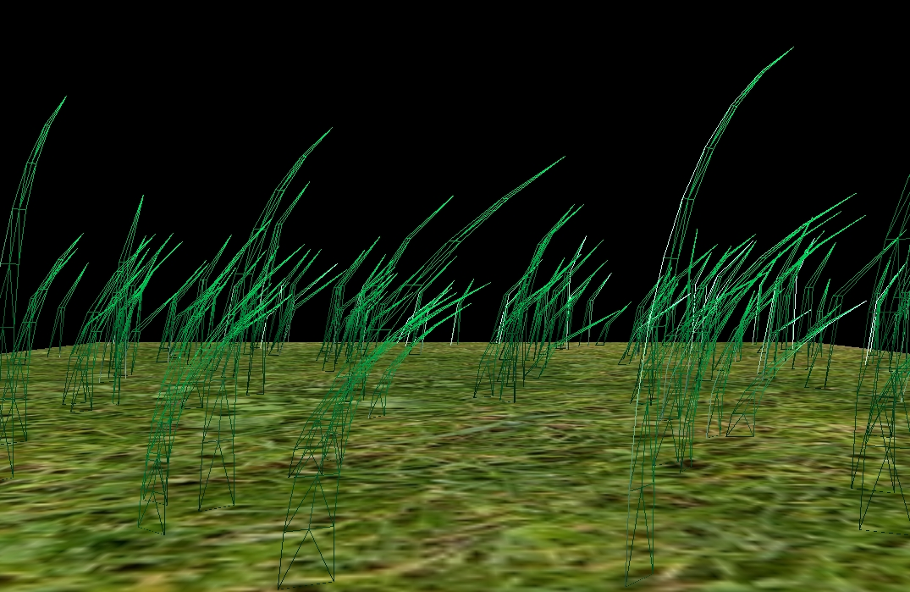
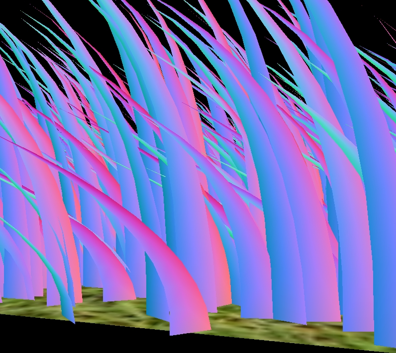
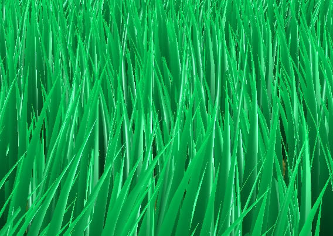
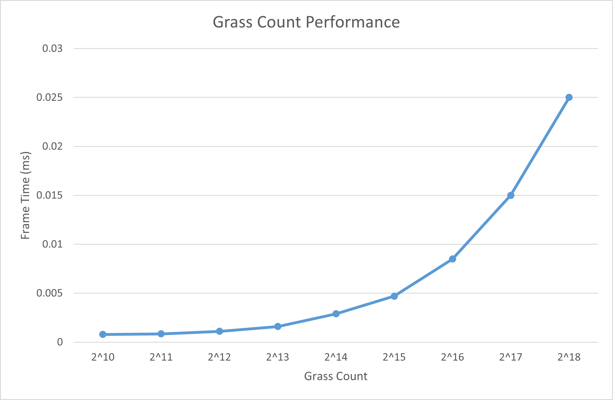
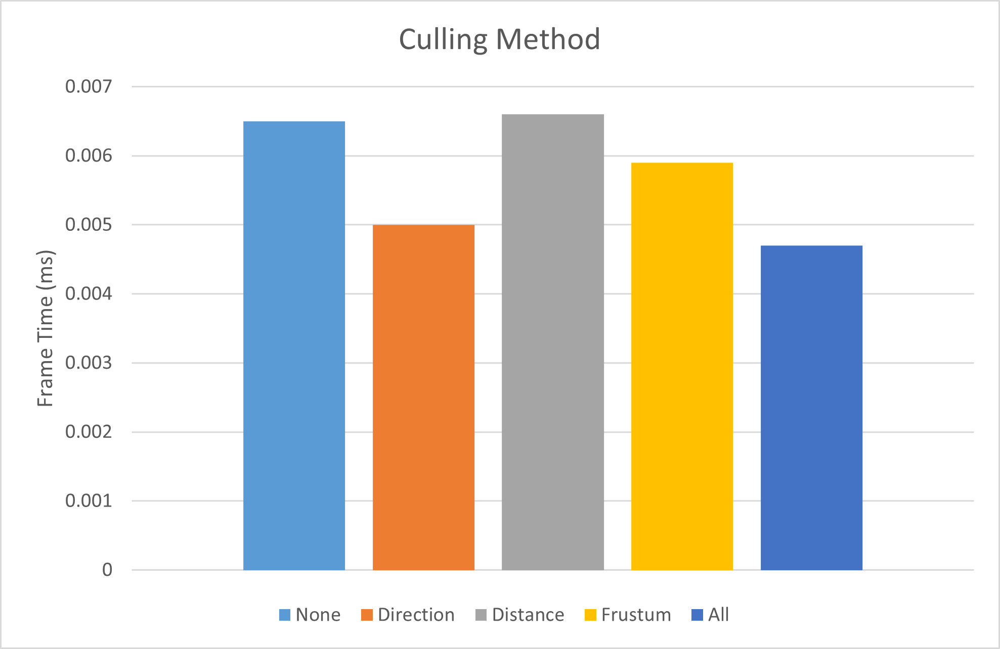

Vulkan Grass Rendering
==================================

**University of Pennsylvania, CIS 565: GPU Programming and Architecture, Project 5**

* Zhen Ren
  * https://www.linkedin.com/in/zhen-ren-837089208/
* Tested on: Windows 11, i9-13900H @ 2.60 GHz 16GB, RTX 4070 Laptop 8GB (Self laptop)

### Features
- Grass update and culling using compute shader
- Grass shape generation using tessellation shader
- Grass LOD
- Grass shading

### LOD

Use distance based lod to make distant grass have less vertices.

### Grass Highligh
In order to make specular light on grass, I bend the surface normal a little bit. This makes shading result more realistic.

### Performance

#### Grass Count

From the graph, we can find that the frame time generally increases linearly, which is expected.

#### Culling Method

The performance of different culling methods depends on the number of grass it can cull out. From the graph, we can see that direction culling and frustum culling have a significant effect. Since most of the grass is within the culling distance, so distance culling is not helpful in this case.